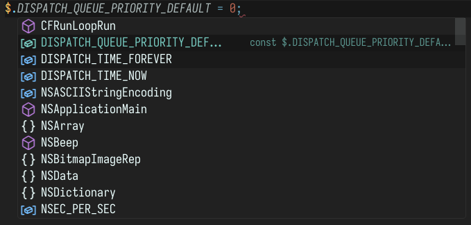

# Typings for JXA

[](https://github.com/Tatsh/jxa-types/tags)
[](https://github.com/Tatsh/jxa-types/blob/master/LICENSE.txt)
[](https://github.com/Tatsh/jxa-types/compare/v0.0.1...master)
[](https://github.com/Tatsh/jxa-types/actions/workflows/codeql.yml)
[](https://github.com/Tatsh/jxa-types/actions/workflows/qa.yml)
[](https://github.com/pre-commit/pre-commit)
[](https://tatsh.github.io/jxa-types/)
[](https://github.com/Tatsh/jxa-types/stargazers)

[](https://bsky.app/profile/Tatsh.bsky.social)
[](https://hostux.social/@Tatsh)



This is a set of typings for AppleScript in JavaScript that works on macOS 10.10 and above.

To use this, add `@types/jxa` to your project.

If you need to use dependencies from NPM you must use a method such as with Webpack to bundle your
code into a single file.

## Library

All types are exported globally to match Objective-C. Some are representations of types from
AppleScript. Most are Objective-C Foundation types. In the `$` namespace, many library functions
are exported. These require calling `ObjC.import` with the appropriate libraries before calling
them.

## Example

```typescript
ObjC.import('Foundation');

const fm = $.NSFileManager.defaultManager;
const exists = fm.fileExistsAtPath(`${$.NSHomeDirectory()}/.bash_history`);

Application('Finder').displayDialog(`Bash history ${exists ? 'exists' : 'does not exist'}.`, {
  buttons: ['OK'],
  defaultButton: 'OK',
  withTitle: 'Greeting',
  withIcon: 'note',
});
```
